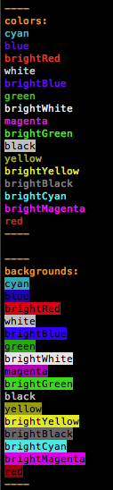
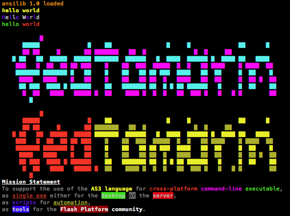

ansilib
=======

A basic library to encode strings with [ANSI escape codes](http://en.wikipedia.org/wiki/ANSI_escape_code)
to provide colors output in the terminal (Linux and Mac OS X).

Install
-------

This AS3 library is meant to be used in the context of [Redtamarin](https://github.com/Corsaair/redtamarin)
or other utilities like [as3shebang](https://github.com/Corsaair/as3shebang).

We do not have yet a package manager for Redtamarin, so you will have
to install "by hand" (eg. copy the right file at the right place).


Usage
-----

**ABC library**

```as3
var ansilib:* = Domain.currentDomain.load( "ansilib.abc" );
trace( ansilib + " loaded"  ); //optional

import encoding.ansi.*;

//use any definitions of the ansi library
```

**sources**

Copy `ansilib/src` to your current AS3 project path.

In your main AS3 file
```as3
include "ansilib.as";

import encoding.ansi.*;

//use any definitions of the ansi library
```

Example
-------

```as3
import encoding.ansi.*;

function testColors():void
{ 
	var name:String;
	var names:Array = colors.all();

	for( var i:uint = 0; i < names.length; i++ )
	{
		name = names[i];
		if( name == "black" )
		{
			trace( colorize( name, colors[ name ], backgrounds.white ) );
			continue;
		}

		trace( colorize( name, colors[ name ] ) );
	}
}

function testBackgrounds():void
{
	var name:String;
	var names:Array = backgrounds.all();

	for( var i:uint = 0; i < names.length; i++ )
	{
		name = names[i];
		if( name == "black" )
		{
			trace( colorize( name, backgrounds[ name ], colors.white ) );
			continue;
		}

		trace( colorize( name, backgrounds[ name ], colors.black ) );
	}
}

trace( "----" );
trace( "colors:" );
testColors();
trace( "----" );
trace( "" );

trace( "----" );
trace( "backgrounds:" );
testBackgrounds();
trace( "----" );
trace( "" );

```

It will look like this



More examples



See the wiki for the [ANSI notation](https://github.com/Corsaair/ansilib/wiki/ANSI_notation).
